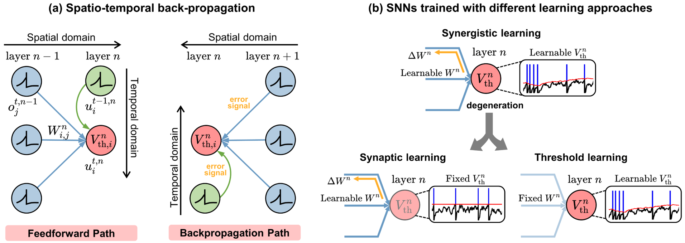

# A Synapse-Threshold Synergistic Learning Approach for Spiking Neural Networks
[Hongze Sun](https://scholar.google.com/citations?user=RNa8D1sAAAAJ&hl=en), [Wuque Cai](https://scholar.google.com/citations?user=wotvHt4AAAAJ&hl=en), Baoxin Yang, [Yan Cui](https://scholar.google.com/citations?user=OQfhoSsAAAAJ&hl=en), Yang Xia, [Dezhong Yao](https://scholar.google.com/citations?user=ClUoWqsAAAAJ&hl=en) and [Daqing Guo](https://scholar.google.com/citations?user=r3XU9PEAAAAJ&hl=en)

## Abstract
Spiking neural networks (SNNs) have demonstrated excellent capabilities in various intelligent scenarios. Most existing methods for training SNNs are based on the concept of synaptic plasticity; however, learning in the realistic brain also utilizes intrinsic non-synaptic mechanisms of neurons. The spike threshold of biological neurons is a critical intrinsic neuronal feature that exhibits rich dynamics on a millisecond timescale and has been proposed as an underlying mechanism that facilitates neural information processing. In this study, we develop a novel synergistic learning approach that involves simultaneously training synaptic weights and spike thresholds in SNNs. SNNs trained with synapse-threshold synergistic learning (STL-SNNs) achieve significantly superior performance on various static and neuromorphic datasets than SNNs trained with two degenerated single-learning models. During training, the synergistic learning approach optimizes neural thresholds, providing the network with stable signal transmission via appropriate firing rates. Further analysis indicates that STL-SNNs are robust to noisy data and exhibit low energy consumption for deep network structures. Additionally, the performance of STL-SNN can be further improved by introducing a generalized joint decision framework. Overall, our findings indicate that biologically plausible synergies between synaptic and intrinsic non-synaptic mechanisms may provide a promising approach for developing highly efficient SNN learning methods.

## STBP and STL-SNNs

Fig. 1. The spatio-temporal back-propagation and learning methods in SNNs. (a) Schematic diagram of spatio-temporal back-propagation. In the feedforward
path, each spiking neuron inherits its previous information in the temporal domain and receives inputs from the preceding layer in the spatial domain. In the
backpropagation path, the error signal is propagated in both the spatial and temporal domains. (b) An illustration of SNNs trained with three different learning
approaches, including synergistic learning between synaptic weights and spike thresholds and two degenerate single-learning versions based on synaptic
learning and threshold learning.

## Requirements
The following setup is tested and it is working:

 * numpy>=1.23.1
   
 * torch>=1.7.1+cu110
   
 * torchvision>=0.8.2+cu110

## Citation
Please cite our [paper](https://ieeexplore.ieee.org/stamp/stamp.jsp?tp=&arnumber=10136703) if you find the work useful.
```
@ARTICLE{
  author={Sun, Hongze and Cai, Wuque and Yang, Baoxin and Cui, Yan and Xia, Yang and Yao, Dezhong and Guo, Daqing},
  journal={IEEE Transactions on Cognitive and Developmental Systems}, 
  title={A Synapse-Threshold Synergistic Learning Approach for Spiking Neural Networks}, 
  year={2023},
  volume={},
  number={},
  pages={1-15},
  doi={10.1109/TCDS.2023.3278712}}
```

